<h1 align="center">
  
</h1>

  
  
  
  

## 🚀 About me
- 🔭 Currently working on **private projects** focused on travel & hospitality tech
- 🌱 Learning **Modern software architecture** (Clean Architecture, DDD, Hexagonal)
- 💬 Ask me about **PHP, Laravel, Vue.js, or anything web-related**
- ⚡ Fun fact: **I talk to rubber ducks more than I'd like to admit 🦆**

## 🛠️ Tech stack

  

  

  

## 📊 GitHub stats

  
  

  

## 🏆 GitHub trophies

  

## 🐍 Contribution graph
<picture>
  <source media="(prefers-color-scheme: dark)" srcset="https://raw.githubusercontent.com/davidmrgaona/davidmrgaona/output/github-snake-dark.svg" />
  <source media="(prefers-color-scheme: light)" srcset="https://raw.githubusercontent.com/davidmrgaona/davidmrgaona/output/github-snake.svg" />
  
</picture>

---

  <i>If I can help you, I will be happy to do so!</i>

